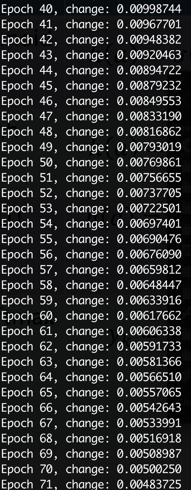
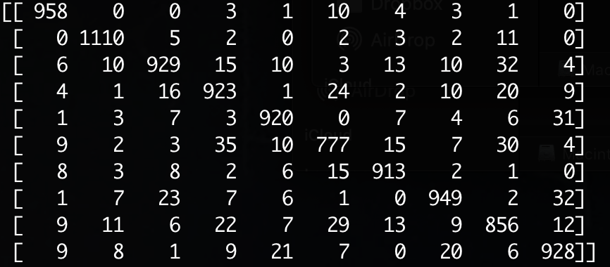

# Hand-written digit recognition using multi-class logistic regression

- Simple program to recognize hand-written digits from mnist data using multi-class logistic regression
- Plot the confusion matrix

> Training



> Confusion matrix




## Get started

> First time

```bash
make all
```

> After first time

```bash
make start
```


## Dependency:

- Python 3+
- numpy
- tensorflow
- sklearn
